# 🚀 Wiki OrbitBot - Documentação Completa

<div align="center">


**Bot de WhatsApp Inteligente com IA, Transcrição de Áudio e Sistema Modular Avançado**

[📋 Índice](#-índice) • [🚀 Início Rápido](#-início-rápido) • [📚 Documentação](#-documentação) • [🔧 Configuração](#-configuração)

</div>

---

## 📋 Índice

1. [🎯 Visão Geral](#-visão-geral)
2. [🚀 Início Rápido](#-início-rápido)
3. [🏗️ Arquitetura do Sistema](#️-arquitetura-do-sistema)
4. [🤖 Sistema de IA](#-sistema-de-ia)
5. [🎵 Sistema de Áudio](#-sistema-de-áudio)
6. [🗄️ Banco de Dados](#️-banco-de-dados)
7. [🔄 Sistema de Backup](#-sistema-de-backup)
8. [⚡ Performance e Cache](#-performance-e-cache)
9. [🛠️ Comandos Administrativos](#️-comandos-administrativos)
10. [🔌 Sistema de Plugins](#-sistema-de-plugins)
11. [📊 Monitoramento](#-monitoramento)
12. [🔧 Configuração Avançada](#-configuração-avançada)
13. [🐛 Troubleshooting](#-troubleshooting)
14. [📈 Métricas e Estatísticas](#-métricas-e-estatísticas)
15. [🔮 Roadmap](#-roadmap)

---

## 🎯 Visão Geral

O **OrbitBot** é um bot de WhatsApp de última geração que combina inteligência artificial avançada, processamento de áudio em tempo real e um sistema modular robusto. Desenvolvido para freelancers e pequenos negócios, oferece atendimento automatizado inteligente com personalização completa.

### ✨ Características Principais

- 🤖 **IA Avançada**: Integração com DeepSeek via OpenRouter
- 🎵 **Transcrição de Áudio**: Processamento automático via Whisper
- 🗄️ **Banco SQLite**: Performance otimizada e integridade de dados
- 🔄 **Backup Automático**: Sistema robusto de backup e restauração
- ⚡ **Performance**: 50% mais rápido que versões anteriores
- 🧠 **Contexto Inteligente**: Memória completa de conversas
- 🔌 **Sistema Modular**: Plugins e extensões dinâmicas
- 📊 **Monitoramento**: Métricas em tempo real

---

## 🚀 Início Rápido

### Pré-requisitos

```bash
# Node.js 16+ e Python 3.7+
node --version  # v16.0.0+
python --version  # Python 3.7+
```

### Instalação

```bash
# 1. Clone o repositório
git clone https://github.com/GaabDevWeb/OrbitBot.git
cd OrbitBot

# 2. Instale dependências Node.js
npm install

# 3. Instale dependências Python
pip install openai

# 4. Configure as APIs
# Edite src/openai.js e transcrever_audio.py
```

### Configuração Rápida

```javascript
// src/openai.js
const OPENROUTER_API_KEY = 'sua-chave-openrouter';

// transcrever_audio.py
openai.api_key = "sua-chave-openai"
```

### Execução

```bash
npm start
# ou
node app.js
```

---

## 🏗️ Arquitetura do Sistema

### Estrutura de Diretórios

```
OrbitBot/
├── 📁 src/                    # Código fonte principal
│   ├── 🤖 bot.js             # Lógica principal do bot
│   ├── 🧠 openai.js          # Integração com IA
│   ├── 🎵 audioProcessor.js  # Processamento de áudio
│   ├── 🗄️ aiConfig.js        # Configurações de IA
│   ├── 🔄 backup.js          # Sistema de backup
│   ├── 📊 performance.js     # Monitoramento
│   ├── 🔌 pluginSystem.js    # Sistema de plugins
│   ├── 📝 logger.js          # Sistema de logs
│   ├── ⚡ queue.js           # Sistema de filas
│   └── 🎭 humanizer.js       # Simulação humana
├── 📁 database/              # Banco de dados
│   ├── 📁 data/              # Arquivos SQLite
│   ├── 📁 backups/           # Backups automáticos
│   ├── 🗄️ db.js             # Operações SQLite
│   └── 📋 index.js           # Interface de exportação
├── 📁 plugins/               # Plugins customizados
├── 📁 audios/                # Áudios temporários
├── 🐍 transcrever_audio.py   # Script de transcrição
└── 🚀 app.js                 # Ponto de entrada
```

### Fluxo de Processamento

```mermaid
graph TD
    A[Mensagem Recebida] --> B{É Áudio?}
    B -->|Sim| C[Processamento de Áudio]
    B -->|Não| D[Processamento de Texto]
    C --> E[Transcrição Whisper]
    E --> F[Melhoria com IA]
    F --> G[Processamento Normal]
    D --> G
    G --> H[Busca Histórico]
    H --> I[Geração de Resposta]
    I --> J[Humanização]
    J --> K[Envio]
    K --> L[Atualização Histórico]
```



---

## 🤖 Sistema de IA

### Modelos Disponíveis

| Modelo | Descrição | Tokens | Temperatura | Uso |
|--------|-----------|--------|-------------|-----|
| `deepseek-chat` | Conversas gerais | 250 | 0.7 | Padrão |
| `deepseek-coder` | Código e tecnologia | 250 | 0.3 | Técnico |
| `deepseek-chat-33b` | Conversas complexas | 250 | 0.8 | Avançado |

### Personalidades

#### Personalidades Base

```javascript
// Personalidade Padrão
{
    name: 'Orbit - Assistente Pessoal',
    description: 'Assistente pessoal do Gabriel',
    model: 'deepseek-chat',
    contextWindow: 10
}

// Personalidade Profissional
{
    name: 'Orbit - Profissional',
    description: 'Versão profissional para clientes',
    model: 'deepseek-chat',
    contextWindow: 15
}

// Personalidade Desenvolvedor
{
    name: 'Orbit - Desenvolvedor',
    description: 'Especialista em programação',
    model: 'deepseek-coder',
    contextWindow: 20
}
```

#### Personalidades Compostas

```javascript
// Tech-Friendly (70% desenvolvedor + 30% amigável)
{
    weights: {
        coder: 0.7,
        friendly: 0.3,
        professional: 0.0,
        default: 0.0
    }
}

// Business-Casual (60% profissional + 40% amigável)
{
    weights: {
        professional: 0.6,
        friendly: 0.4,
        coder: 0.0,
        default: 0.0
    }
}
```

### Contexto Dinâmico

O sistema detecta automaticamente o contexto da conversa:

- **Técnico**: Código, bugs, desenvolvimento
- **Negócios**: Preços, orçamentos, propostas
- **Pessoal**: Saudações, conversas casuais
- **Urgente**: Deadlines, problemas críticos

### Comandos de IA

```bash
# Personalidades
/ai personalidade listar          # Lista todas as personalidades
/ai personalidade [nome]          # Altera personalidade
/ai personalidade info            # Mostra personalidade atual
/ai personalidade composta criar coder:0.7,friendly:0.3

# Modelos
/ai modelo listar                 # Lista todos os modelos
/ai modelo [nome]                 # Altera modelo atual
/ai modelo info                   # Mostra modelo atual

# Contexto
/ai contexto auto on/off          # Habilita/desabilita detecção automática
/ai contexto adaptacao on/off     # Habilita/desabilita adaptação automática
/ai contexto info                 # Mostra configurações

# Quebra de Linhas
/ai quebra testar [texto]         # Testa quebra de linhas com IA
/ai quebra info                   # Mostra informações

# Estatísticas
/ai stats                         # Mostra estatísticas completas
/ai cache limpar                  # Limpa cache de respostas
```

---

## 🎵 Sistema de Áudio

### Características

- **Detecção Automática**: Mensagens de áudio processadas automaticamente
- **Transcrição Whisper**: Integração com OpenAI Whisper
- **Melhoria com IA**: Correção automática de transcrições
- **Contexto Inteligente**: Adaptação baseada no tipo de negócio
- **Limpeza Automática**: Áudios removidos após 1 hora

### Modos de Processamento

#### Modo Rápido
```javascript
{
    name: 'Rápido',
    speed: 'Máxima',
    timeout: '10s',
    model: 'Tiny (39MB)',
    precision: 'Boa',
    priority: 'Velocidade'
}
```

#### Modo QUALIDADE MÁXIMA
```javascript
{
    name: 'QUALIDADE MÁXIMA',
    speed: 'Média',
    timeout: '45s',
    model: 'Large (1550MB) + Medium + Small',
    precision: 'EXCELENTE',
    priority: 'QUALIDADE MÁXIMA'
}
```

### Estratégias de Melhoria

1. **Ultra Preciso**: Temperatura 0.0, máxima precisão
2. **Contextual Agressivo**: Adaptação ao contexto do negócio
3. **Conservador**: Mudanças mínimas, apenas correções óbvias

### Detecção de Contexto de Negócio

```javascript
const businessTypes = {
    'restaurante': ['cardápio', 'menu', 'prato', 'comida', 'pedido'],
    'barbearia': ['corte', 'barba', 'cabelo', 'agendamento'],
    'bar': ['cerveja', 'drink', 'bebida', 'happy hour'],
    'servico_tecnico': ['código', 'bug', 'erro', 'sistema'],
    'consultoria': ['projeto', 'orçamento', 'proposta', 'reunião']
};
```

### Comandos de Áudio

```bash
# Estatísticas
/audio stats                       # Mostra estatísticas de processamento
/audio status                      # Mostra status atual do sistema

# Modo de Processamento
/audio modo rapido                 # Ativa modo rápido
/audio modo preciso                # Ativa QUALIDADE MÁXIMA
/audio modo alternar               # Alterna entre modos
/audio modo info                   # Mostra modo atual

# IA e Melhorias
/audio correcoes exemplo           # Mostra exemplos de melhorias
/audio correcoes testar [texto]    # Testa melhoria com IA
/audio correcoes comparar [texto]  # Mostra antes/depois
/audio correcoes contexto [texto]  # Testa com contexto inteligente

# Configurações
/audio modelo [tiny/base/small/medium/large]  # Altera modelo do Whisper
/audio modelo info                 # Mostra modelo atual
```

---

## 🗄️ Banco de Dados

### Estrutura SQLite

```sql
-- Tabela de Clientes
CREATE TABLE clientes (
    id INTEGER PRIMARY KEY AUTOINCREMENT,
    numero TEXT UNIQUE NOT NULL,
    created_at DATETIME DEFAULT CURRENT_TIMESTAMP
);

-- Tabela de Histórico
CREATE TABLE historico (
    id INTEGER PRIMARY KEY AUTOINCREMENT,
    cliente_id INTEGER NOT NULL,
    mensagem TEXT NOT NULL,
    role TEXT NOT NULL,
    created_at DATETIME DEFAULT CURRENT_TIMESTAMP,
    FOREIGN KEY (cliente_id) REFERENCES clientes(id)
);

-- Índices para Performance
CREATE INDEX idx_historico_cliente ON historico(cliente_id);
CREATE INDEX idx_historico_created ON historico(created_at);
```

### Operações Principais

```javascript
// Cadastrar cliente
const cliente = await cadastrarCliente(numero);

// Buscar cliente
const cliente = await buscarCliente(numero);

// Adicionar mensagem ao histórico
await atualizarHistorico(clienteId, mensagem, 'user');

// Buscar histórico com paginação
const historico = await buscarHistorico(clienteId, pagina, limite);

// Buscar últimas mensagens
const ultimas = await buscarUltimasMensagens(clienteId, limite);
```

### Performance

- **50% mais rápido** que arquivos JSON
- **70% menor** em tamanho
- **Transações atômicas** para integridade
- **Índices otimizados** para consultas rápidas

---

## 🔄 Sistema de Backup

### Características

- **Backup Automático**: A cada 6 horas
- **Backup Manual**: Com nome personalizado
- **Limpeza Automática**: Mantém últimos 5 backups
- **Restauração Flexível**: Busca por nome parcial
- **Log Detalhado**: Histórico completo de operações

### Estrutura de Backups

```
database/backups/
├── backup auto_20-06-25_14-30/    # Backup automático
├── backup importante/              # Backup manual
├── backup 20-06-25 15-45/         # Backup com timestamp
└── backup_log.json                # Log de operações
```

### Comandos de Backup

```bash
# Criação e Gerenciamento
/backup criar [nome]               # Cria backup com nome opcional
/backup listar                     # Lista todos os backups
/backup excluir [nome]             # Exclui backup específico

# Informações
/backup atual                      # Mostra informações do backup atual
/backup info [nome]                # Mostra informações detalhadas

# Restauração e Logs
/backup restaurar [nome]           # Restaura backup específico
/backup logs                       # Mostra últimas operações
```

### Informações de Backup

```javascript
{
    totalClientes: 150,
    totalMensagens: 2500,
    size: 2048576,                 // Bytes
    created_at: "2025-06-20T14:30:00.000Z",
    isAutomatic: true
}
```

---

## ⚡ Performance e Cache

### Sistema de Cache Multi-Nível

#### Cache de API (LRU)
```javascript
{
    maxSize: 1000,                 // Máximo de itens
    ttl: 30 * 60 * 1000,          // 30 minutos
    strategy: 'LRU'               // Least Recently Used
}
```

#### Cache de Banco de Dados
```javascript
{
    ttl: 30 * 1000,               // 30 segundos
    maxSize: 500,                 // 500 consultas
    strategy: 'TTL'               // Time To Live
}
```

### Sistema de Filas

```javascript
class MessageQueue {
    maxRetries: 3,                // Máximo de tentativas
    retryDelay: 1000,             // Delay entre tentativas
    processing: false,            // Status de processamento
    queue: []                     // Fila de mensagens
}
```

### Otimizações Implementadas

- **Compressão de Mensagens**: Redução de 40% no tamanho
- **Retry com Backoff**: Tentativas inteligentes
- **Paginação Eficiente**: Limitação de histórico
- **Processamento Assíncrono**: Não bloqueia o bot
- **Limpeza Automática**: Cache e arquivos temporários

### Métricas de Performance

```javascript
{
    responseTime: "1.2s",         // Tempo médio de resposta
    memoryUsage: "40MB",          // Uso de memória
    cacheHitRate: "85%",          // Taxa de acerto do cache
    errorRate: "0.5%",            // Taxa de erro
    uptime: "99.8%"              // Tempo de atividade
}
```

---

## 🛠️ Comandos Administrativos

### Configuração de Administradores

```javascript
// src/bot.js
const ADMIN_NUMBERS = [
    '5554996121107@c.us',         // Número principal
    '5511999999999@c.us'          // Números adicionais
];
```

### Comandos Disponíveis

#### Sistema de Backup
```bash
/backup criar backup_importante    # Cria backup manual
/backup listar                     # Lista todos os backups
/backup restaurar "backup 20-06"   # Restaura (busca flexível)
/backup info backup_importante     # Informações detalhadas
/backup excluir backup_antigo      # Remove backup
/backup logs                       # Histórico de operações
```

#### Sistema de Áudio
```bash
/audio stats                       # Estatísticas de processamento
/audio status                      # Status do sistema
/audio modo rapido                 # Modo rápido
/audio modo preciso                # QUALIDADE MÁXIMA
/audio correcoes exemplo           # Exemplos de melhorias
/audio modelo medium               # Altera modelo Whisper
```

#### Sistema de IA
```bash
/ai personalidade tech-friendly    # Altera personalidade
/ai modelo deepseek-coder          # Altera modelo
/ai contexto auto on               # Habilita detecção automática
/ai quebra testar "texto longo"    # Testa quebra de linhas
/ai stats                          # Estatísticas completas
```

#### Gerenciamento de Dados
```bash
/historico 5554996121107 1         # Histórico com paginação
/reset confirmar                   # Reseta banco (IRREVERSÍVEL)
```

### Segurança

- **Confirmação Dupla**: Para operações críticas
- **Controle de Acesso**: Apenas números autorizados
- **Logs Detalhados**: Rastreamento de todas as operações
- **Validação de Dados**: Verificação de integridade

---

## 🔌 Sistema de Plugins

### Arquitetura de Plugins

```javascript
class PluginSystem {
    plugins: Map,                  // Plugins registrados
    hooks: Map,                    // Hooks do sistema
    middleware: Array,             // Middleware de processamento
    pluginDir: String              // Diretório de plugins
}
```

### Plugins Padrão

#### Análise de Sentimento
```javascript
{
    name: 'Sentiment Analysis',
    version: '1.0.0',
    description: 'Analisa o sentimento das mensagens',
    hooks: {
        'beforeMessage': async (data) => {
            // Análise de sentimento
            return { ...data, sentiment: 'positive' };
        }
    }
}
```

#### Detector de Comandos
```javascript
{
    name: 'Command Detector',
    version: '1.0.0',
    description: 'Detecta comandos especiais',
    hooks: {
        'beforeMessage': async (data) => {
            // Detecção de comandos
            return { ...data, isCommand: true };
        }
    }
}
```

#### Resposta Automática
```javascript
{
    name: 'Auto Response',
    version: '1.0.0',
    description: 'Respostas automáticas',
    hooks: {
        'afterMessage': async (data) => {
            // Respostas automáticas
            return { ...data, autoResponse: 'Oi!' };
        }
    }
}
```

### Hooks Disponíveis

- `beforeMessage`: Antes do processamento
- `afterMessage`: Após o processamento
- `messageProcessed`: Após resposta gerada
- `error`: Em caso de erro

### Middleware

```javascript
// Exemplo de middleware
async function customMiddleware(message, next) {
    // Processamento customizado
    const result = await next();
    // Pós-processamento
    return result;
}
```

### Comandos de Plugins

```bash
/ai plugin listar                  # Lista todos os plugins
/ai plugin [nome] on/off           # Habilita/desabilita
/ai plugin info [nome]             # Informações do plugin
```

---

## 📊 Monitoramento

### Métricas em Tempo Real

```javascript
{
    // Performance
    uptime: 86400,                 // Segundos de execução
    messageCount: 1250,            // Total de mensagens
    avgResponseTime: 1200,         // Tempo médio (ms)
    errorCount: 5,                 // Total de erros
    
    // Recursos
    memory: {
        heapUsed: 40,              // MB
        heapTotal: 60,             // MB
        external: 5                // MB
    },
    cpu: {
        '1min': 0.5,               // Load médio
        '5min': 0.3,               // Load 5min
        '15min': 0.2               // Load 15min
    },
    
    // Banco de Dados
    database: {
        totalClientes: 150,
        totalMensagens: 2500,
        size: 2048576              // Bytes
    },
    
    // Áudio
    audio: {
        totalProcessed: 45,
        successfulTranscriptions: 42,
        successRate: "93.3%",
        avgConfidence: 0.85
    }
}
```

### Logs Estruturados

```javascript
logger.info('Mensagem processada', {
    userId: '5554996121107',
    messageLength: 25,
    responseTime: 1200,
    cacheHit: true,
    timestamp: new Date()
});
```

### Alertas Automáticos

- **Alta Taxa de Erro**: >5% de erros
- **Memória Alta**: >80% de uso
- **CPU Alto**: >90% de load
- **Cache Baixo**: <50% de hit rate

---

## 🔧 Configuração Avançada

### Variáveis de Ambiente

```bash
# APIs
OPENROUTER_API_KEY=sk-or-v1-...
OPENAI_API_KEY=sk-...

# Configurações do Bot
BOT_SESSION_NAME=sessionName
BOT_MULTIDEVICE=true
BOT_HEADLESS=false

# Banco de Dados
DB_PATH=./database/data/orbitbot.db
BACKUP_DIR=./database/backups

# Performance
CACHE_TTL=1800000
CACHE_MAX_SIZE=1000
QUEUE_MAX_RETRIES=3
```

### Configuração de Personalidades

```javascript
// src/aiConfig.js
const PERSONALITIES = {
    'custom': {
        name: 'Minha Personalidade',
        description: 'Personalidade customizada',
        systemPrompt: `
            Você é um assistente personalizado.
            [Seu prompt customizado aqui]
        `,
        model: 'deepseek-chat',
        contextWindow: 15
    }
};
```

### Configuração de Áudio

```python
# transcrever_audio.py
MODEL_CONFIG = {
    'tiny': {
        'size': '39MB',
        'speed': 'fast',
        'accuracy': 'good'
    },
    'medium': {
        'size': '244MB',
        'speed': 'medium',
        'accuracy': 'very_good'
    },
    'large': {
        'size': '1550MB',
        'speed': 'slow',
        'accuracy': 'excellent'
    }
}
```

### Configuração de Backup

```javascript
// src/backup.js
const BACKUP_CONFIG = {
    autoInterval: 6 * 60 * 60 * 1000,  // 6 horas
    maxBackups: 5,                      // Máximo de backups
    compression: true,                   // Compressão
    encryption: false                    // Criptografia (futuro)
};
```

---

## 🐛 Troubleshooting

### Problemas Comuns

#### Bot Não Inicia

```bash
# Verificar dependências
npm list
python --version

# Verificar APIs
node -e "console.log(process.env.OPENROUTER_API_KEY ? 'OK' : 'FALTANDO')"

# Verificar permissões
ls -la database/data/
```

#### Erro de Transcrição

```bash
# Verificar Python
python transcrever_audio.py test.ogg

# Verificar OpenAI
python -c "import openai; print(openai.api_key)"

# Verificar arquivos
ls -la audios/
```

#### Problemas de Performance

```bash
# Verificar memória
node -e "console.log(process.memoryUsage())"

# Verificar cache
/ai cache limpar

# Verificar banco
sqlite3 database/data/orbitbot.db "VACUUM;"
```

### Logs de Debug

```javascript
// Habilitar logs detalhados
logger.debug('Processamento detalhado', {
    message: 'Texto da mensagem',
    userId: '5554996121107',
    timestamp: new Date()
});
```

### Comandos de Diagnóstico

```bash
# Status do sistema
/ai stats
/audio status
/backup atual

# Limpeza
/ai cache limpar
/reset confirmar  # CUIDADO!

# Testes
/ai quebra testar "Texto de teste"
/audio correcoes testar "Teste de transcrição"
```

---

## 📈 Métricas e Estatísticas

### Dashboard de Performance

```javascript
// Métricas Gerais
{
    uptime: "24h 30m",
    totalMessages: 1250,
    avgResponseTime: "1.2s",
    errorRate: "0.5%",
    successRate: "99.5%"
}

// Métricas de IA
{
    totalPersonalities: 4,
    totalModels: 3,
    contextDetectionRate: "85%",
    personalityAdaptationRate: "70%"
}

// Métricas de Áudio
{
    totalProcessed: 45,
    successRate: "93.3%",
    avgConfidence: "0.85",
    improvementRate: "78%"
}

// Métricas de Cache
{
    hitRate: "85%",
    missRate: "15%",
    avgTTL: "25min",
    size: "750/1000"
}
```

### Relatórios Automáticos

O sistema gera relatórios automáticos a cada hora:

```javascript
// Relatório Horário
{
    period: "2025-06-20 14:00-15:00",
    messages: 45,
    audioProcessed: 3,
    errors: 1,
    avgResponseTime: 1150,
    cacheHitRate: 87
}
```

### Exportação de Dados

```bash
# Exportar histórico
sqlite3 database/data/orbitbot.db ".dump historico" > historico.sql

# Exportar estatísticas
node -e "console.log(JSON.stringify(require('./src/performance').getStats(), null, 2))"
```

---

## 🔮 Roadmap

### Versão 2.1 (Próxima)
- [ ] Sistema de pedidos e cardápio digital
- [ ] Rate limiting para evitar spam
- [ ] Dashboard web para monitoramento
- [ ] Suporte a múltiplos idiomas

### Versão 2.2 (Médio Prazo)
- [ ] Compressão de áudios
- [ ] Cache de transcrições
- [ ] Sistema de notificações
- [ ] Integração com APIs externas

### Versão 3.0 (Longo Prazo)
- [ ] Interface web completa
- [ ] Multi-tenant (múltiplos bots)
- [ ] Machine Learning avançado
- [ ] Análise preditiva

### Melhorias Técnicas
- [ ] Docker containerization
- [ ] CI/CD pipeline
- [ ] Testes automatizados
- [ ] Documentação API

---

## 📞 Suporte

### Comunidade
- **GitHub Issues**: [Reportar bugs](https://github.com/GaabDevWeb/OrbitBot/issues)
- **Discussions**: [Discussões e ideias](https://github.com/GaabDevWeb/OrbitBot/discussions)

### Contato
- **Desenvolvedor**: Gabriel
- **Email**: [Seu email]
- **WhatsApp**: [Seu número]

### Contribuições

1. Fork o projeto
2. Crie uma branch para sua feature
3. Commit suas mudanças
4. Push para a branch
5. Abra um Pull Request

---

## 📄 Licença

Este projeto está sob a licença MIT. Veja o arquivo [LICENSE](LICENSE) para mais detalhes.

---

<div align="center">

**OrbitBot** - Transformando atendimento com IA

*Desenvolvido com ❤️ por Gabriel*

[⬆️ Voltar ao Topo](#-wiki-orbitbot---documentação-completa)

</div> 
