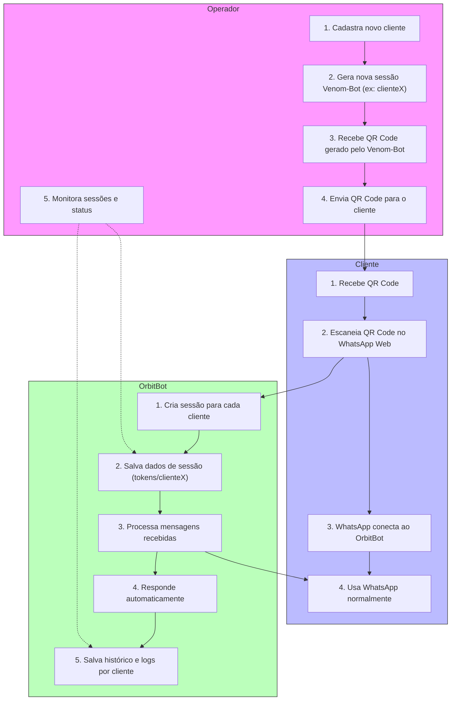

# Relatório: OrbitBot Multi-Cliente com Venom-Bot

## Visão Geral
O OrbitBot pode ser operado em modo multi-cliente, permitindo que vários clientes utilizem o bot simultaneamente, cada um com seu próprio WhatsApp, sem acesso ao código-fonte. O operador (você) gerencia todas as sessões a partir de uma única máquina/servidor.

---

## 1. Fluxo Prático

### Lado do Operador
1. **Cadastra novo cliente** no sistema.
2. **Gera uma nova sessão Venom-Bot** (ex: `clienteX`).
3. **Recebe o QR Code** gerado pelo Venom-Bot.
4. **Envia o QR Code** para o cliente (por e-mail, WhatsApp, painel web, etc).
5. **Monitora sessões** (status online/offline, logs, histórico, etc).

### Lado do Cliente
1. **Recebe o QR Code** do operador.
2. **Escaneia o QR Code** no WhatsApp Web do próprio celular.
3. **WhatsApp conecta ao OrbitBot** (rodando na máquina do operador).
4. **Usa o WhatsApp normalmente**, com todas as funcionalidades do OrbitBot disponíveis.

### Lado do OrbitBot
- Cria e gerencia uma sessão para cada cliente.
- Salva dados de sessão em pastas separadas (`tokens/clienteX/`).
- Processa e responde mensagens automaticamente.
- Salva histórico, backups e logs por cliente.

---

## 2. Fluxograma

---

## 3. Funcionalidades Disponíveis para o Cliente
- Cada cliente tem acesso a **todas as funcionalidades** do OrbitBot: comandos, IA, transcrição de áudio, plugins, histórico, backups, etc.
- O bot responde como se fosse o WhatsApp do cliente.
- Os dados podem ser isolados por cliente (recomendado para privacidade).

---

## 4. Vantagens
- **Controle total:** O operador mantém o código e os dados.
- **Fácil de usar:** O cliente só precisa escanear o QR Code.
- **Multi-cliente:** Vários clientes podem usar simultaneamente, cada um com seu WhatsApp.
- **Personalização:** Possível limitar comandos, plugins ou personalidades por cliente.

---

## 5. Limitações
- **WhatsApp Web só permite um login por vez:** Se o cliente logar em outro PC, desconecta do bot.
- **Privacidade:** O operador tem acesso a todas as mensagens do cliente enquanto a sessão estiver ativa.
- **Escalabilidade:** Para muitos clientes, pode ser necessário usar containers ou VPS mais robustos.

---

## 6. Dicas de Personalização
- **Isolamento de dados:** Use bancos de dados separados ou campos identificadores para cada cliente.
- **Permissões:** Implemente checagem de permissões para comandos sensíveis.
- **Painel web:** Crie um painel para monitorar sessões, enviar QR Codes e ver logs.
- **Backups:** Faça backup separado por cliente.

---

## 7. Resumo
O OrbitBot em modo multi-cliente permite oferecer um serviço completo de automação no WhatsApp para vários clientes, mantendo o controle do código e dos dados, e facilitando a gestão e personalização de cada sessão. 